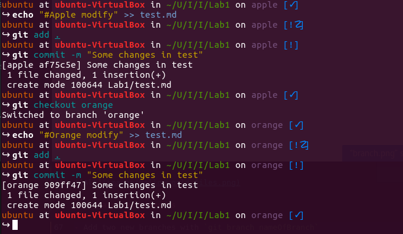

# Integrated Developement Enviroments Laboratory Work Nr.1
## Setting server environment. Version Control Systems

For this laboratory work as a remote server I will use a Ubuntu 15.04 Virtual Mashine.

## Connect via ssh

- Lets first of all check if we can see the machine. Ping it using ``` ping -c 192.168.0.102``` You should get something like this:


Now we can easily connect with ssh to our remote server. In linux distributors we type in ```ssh  ubuntu@192.168.0.102```. You have to enter password to your ubuntu server.


- Next we will install fish shell, a smart and user-friendly command line shell for Linux. More information [here](https://fishshell.com/).  
For installing fish we have to run following commands:
   * `sudo apt-add-repository ppa:fish-shell/release-2`
   * `sudo apt-get update`
   * `sudo apt-get install fish`
   * `fish` (to switch to fish shell)
   * `curl -L https://get.oh-my.fish | fish` (to install oh-my-fish. Check it [here](https://github.com/oh-my-fish/oh-my-fish))
   * `omf install simple-ass-prompt` (to install a simple theme)
Shell should look like:


- Now we can perform any command from our terminal!

## Set up git

- First of all we have to install git `sudo apt-get install git`
- Configure global user	name `git config --global user.name "sspatari"`
- Configure global user	email `git config --global user.email "spatari.stanislav@gmail.com"`
- Generate ssh key with `ssh-keygen`
- Set the public key in github
- Now we will clone the created remote repository `git clone git@github.com:sspatari/IDE_Labs.git`
- Now we can work further on this project

## Run some simple programs
 - By default ubuntu has python installed so we can run any python script. However in order to run any others we have install the necessary compilers. So type in the following commands to install gcc, g++, ruby and nodejs:  

     ```
     sudo apt-get install ruby-full
     sudo apt-get install -y nodejs
     ```
 - After installation we can run HelloWorldPrograms that are located in `hello_world_files/`.

     ```
     python hello_world_files/index.py

     ruby hello_world_files/index.rb

     node hello_world_files/index.js

     gcc hello_world_files/index.c -o main
     ./main

     g++ hello_world_files/index.cpp -o maincpp
     ./maincpp

     ```


## Create new branches

- Add two new branches with `git branch nameOfBranch`
- Move to new branch with `git checkout nameOfBranch`
- Now we can commit to a new branch
- If we want to move back or to another branch use again `git checkout anotherBranchName`

This is how it looks in command line:


## Committing on each branch

- After switching to another branch using `git checkout apple`
- Create a file and write in it using `echo "#Apple changes" >> test.md`
- Adds all files to your local repository and stages it for commit. `git add .` (To unstage a file, use `git reset HEAD YOUR-FILE`.)
- Commit changes using `git commit -m "Some changes in test"`

It looks like:



## Reset a branch to previous commit
- First we should see all our commits using command: `git log`

    

- Temporarily switch to a different commit: `git checkout <commitID>`

    

- Hard delete unpublished commits: `git reset --hard <commitID>` (will return do selected commit)

    

## Merge branches and resolve a conflicts
We will merge apple branch in orange, so we should be on orange branch using `git checkout orange`  
Next merge using `git merge apple`


We successful merged 2 branches but we have a conflict. Let solve it and commit changes. I will use vim to edit test.md file. More about vim [here](http://www.vim.org/)


## Shell script
- To run a file from our HelloWorldPrograms folder we will write a shell script

     ```
     #!/bin/sh

     echo Enter file name
     read FILE
     case $FILE in
      *.cpp) gcc HelloWorldPrograms/$FILE -o ${FILE%.*} && ./${FILE%.*}
      ;;
      *.c) gcc HelloWorldPrograms/$FILE -o ${FILE%.*} && ./${FILE%.*}
      ;;
     	*.py) python HelloWorldPrograms/$FILE
      ;;
      *.js) nodejs HelloWorldPrograms/$FILE
      ;;
      *.rb) ruby HelloWorldPrograms/index.rb
      ;;

     esac
     ```

 - Give execute permission to script: `chmod +x /path/to/my_script.sh`
 - Run script: `./my_script.sh`

     

## GIT hooks
Git hooks are scripts that Git executes before or after events such as: commit, push, and receive. You can find more info [here](http://githooks.com/).
I will make a simple script in shell that will print the number of commits on branch before each commit

Shell code:
```
#!/bin/sh

currentbranch=`git branch | awk '/\*/ { print $2; }'`
number=`git rev-list --count $currentbranch`

echo $number 'commits on this branch'
```
- Create file `pre-commit` in `.git/hooks` folder
- Paste code above in it
- Give execute permission to script: `chmod +x pre-commit`

And the result:


## GIT rebase
git-rebase - Reapply commits on top of another base tip. You can find more about it [here](https://git-scm.com/docs/git-rebase).  


## GIT cherry-pick
git-cherry-pick - Apply the changes introduced by some existing commits. More [here](https://git-scm.com/docs/git-cherry-pick)  


