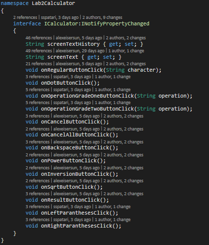
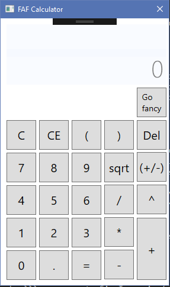
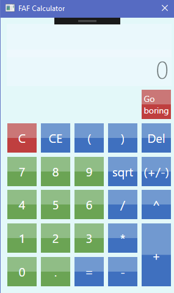
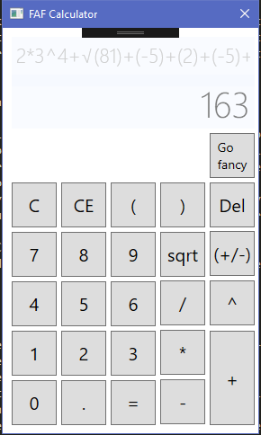
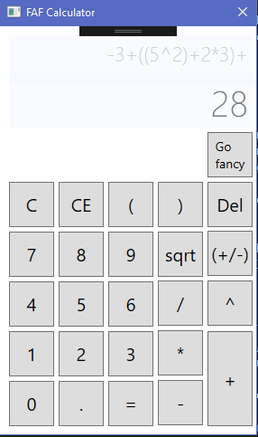

# Integrated Developement Enviroments Laboratory Work Nr.2
## Short description

For this laboratory work the work was devided in 2 parts the UI and the Bussiness-Logic. I was the person behind bussiness logic. And my partner Alexei Sersun was the guy behind the UI.
After searching how could I parse the text and obtain an expression, I first wanted to use a build in Datatable Class and everything would have been good but after about 2 hours of implementing the basic operations I relised that the more complex operations like power and sqrt could not be implemented using it. I then changed y aproach and wanted to use javascript as a tool to analise the mathematical expression that was written but then I relised that it didn't suit my needs because in oder to implement for example the power operation the analised string should contain the javascript ```Math.pow()``` string but I wanted the string to contain the ```^```, the same with the ```Math.sqrt()```. I didn't like this aproach. After reading different methods to parse an expression and determine its value I found out about Reverse polish notation Algorithm. And I decided to implement it. ```Because why not!!!```. More about it in the below paragraph. This project was implemented in C# (my first time writing in this language :D), the UI part was written using WPF. ```Why? you ask```. ```Because we knew that everybody would have used WinForms insteed```. More about it [here](https://msdn.microsoft.com/en-us/library/ms754130(v=vs.110).aspx) The IDE used was Microsoft Visual Studio.

## Reverse polish notation

- Reverse Polish notation (RPN) is a mathematical notation in which every operator follows all of its operands, in contrast to Polish notation (PN), which puts the operator before its operands. It is also known as postfix notation. It does not need any parentheses as long as each operator has a fixed number of operands. More information [here](https://en.wikipedia.org/wiki/Reverse_Polish_notation).

- In reverse Polish notation the operators follow their operands; for instance, to add 3 and 4, one would write "3 4 +" rather than "3 + 4". If there are multiple operations, the operator is given immediately after its second operand; so the expression written "3 − 4 + 5" in conventional notation would be written "3 4 − 5 +" in RPN: 4 is first subtracted from 3, then 5 added to it. An advantage of RPN is that it removes the need for parentheses that are required by infix notation. While "3 − 4 × 5" can also be written "3 − (4 × 5)", that means something quite different from "(3 − 4) × 5". In postfix, the former could be written "3 4 5 × −", which unambiguously means "3 (4 5 ×) −" which reduces to "3 20 −"; the latter could be written "3 4 − 5 ×" (or 5 3 4 − ×, if keeping similar formatting), which unambiguously means "(3 4 −) 5 ×".

- A short demonstration of what was I obtained after implementing it. The equation 
``` 2*3^4+(1.5+2.4/2) ``` and the reverse polish notation expression is ``` 2 3 4 ^ * 1.5 2.4 2 / + + ```

## Calculator bases

- In order to make it posible to work in parallel with the UI and to permite my partner to call the methods that may not be implemented yet, I first created the ICalculator interface that contained the methods that should be called from the UI part.
The interface:


- The Reverse polish notation is implemented in te Rpn.cs. The most important method are the ```GetExpresssion method```  and the ```Counting method```. The first one returns the reverse polish notation output and the second computes the result of the reverse polish notation output.

- The CalculatorClass is the place where method used by buttons where implemented and of course some additional ones that where meant to help in this procces.

## Main features

- The calculator all the simple operation ```+,-,/,*``` and at the same time the complex ones given by ```power, sqrt, SignInversion(+/-)```.
- It supports operations with decimal floating point numbers.
- It contains the GUI and Bussiness logic module.
- At this project worked 2 persons on the same reposiotory having 3 braches ```master, business-logic and ui```.
- It also provides posibility to switch the user interface part to a more fancy one.
- Also as part of the bussiness logic the result is computed after each press of an operation based on the inner most paranteses if it exists, basically like in al Scientific Calculators.






## Conclusion
So, it was really cool to create this calculator application, aspecially in a team. The process of resolving conflict and merging all, and seeing that it works gives you the idea how are real applications implemented. Taking into account that it was my first time writing c# code, I know that many thing could have been implemented in other ways maybe better maybe no. At the same time I can say that this project can be further upgraded. I also implemented the negate function but didn't used it. Feel free to use my code and change it to your own desire. Enough talk dowload it and see your self. :D.
